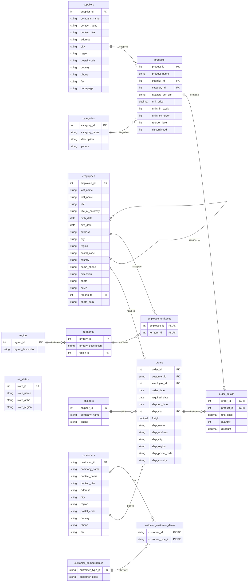

# Northwind_csv

For further information on the Northwind database, please refer to the
links below.

- https://docs.microsoft.com/en-us/dotnet/framework/data/adonet/sql/linq/downloading-sample-databases
- https://github.com/Microsoft/sql-server-samples/tree/master/samples/databases/northwind-pubs

## Schema

Entity-relationship diagram of all 14 tables present as CSV files in this
repository, derived from each file's actual header row (not from
`Northwind.dbml`, which only covers `Customers`/`Orders` and predates the
Territory/Demographics tables added later).

`employees.reports_to` is self-referencing (each employee's manager, also an
employee). `us_states` is standalone reference data with no formal foreign
key into the rest of the schema. `customer_demographics` and
`customer_customer_demo` are header-only (0 data rows) - a well-known quirk
of the classic Northwind sample, not a defect in this checkout.

| Table | Rows |
|---|---|
| categories | 8 |
| suppliers | 29 |
| products | 77 |
| customers | 91 |
| orders | 830 |
| order_details | 2155 |
| employees | 9 |
| shippers | 6 |
| region | 4 |
| territories | 53 |
| employee_territories | 49 |
| customer_demographics | 0 |
| customer_customer_demo | 0 |
| us_states | 51 |

## Used by

The [TextDb](https://github.com/SpocWeb/NET/tree/master/_std/db/TextDb)
file-backed database engine's demo suite
([`Northwind/`](https://github.com/SpocWeb/NET/tree/master/_std/db/TextDb/Northwind))
reads these CSVs directly, unmodified, as live tables - exercising 6 of the
14 (`categories`, `suppliers`, `products`, `customers`, `orders`,
`order_details`). Tests reset this repository to a clean checkout
(`git checkout -- .` + `git clean -fd`) before each run, so any local
mutations left over from a previous demo run are expected and safe to
discard.
