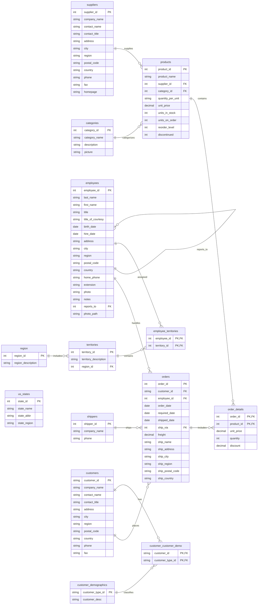

# Northwind_csv

For further information on the Northwind database, please refer to the
links below.

- https://docs.microsoft.com/en-us/dotnet/framework/data/adonet/sql/linq/downloading-sample-databases
- https://github.com/Microsoft/sql-server-samples/tree/master/samples/databases/northwind-pubs

### Table Kind Legend

| Kind        |  #| Meaning                                                                                              |
| ----------- | --| ------------------------------------------------------------------------------------------------------ |
| Primary     | 11| Independent master/reference entity; owns its own identity and surrogate or natural key.                |
| Subtype     |  0| 1:1 extension row whose primary key is also a foreign key to its supertype (e.g. `Employee` extends `Person`). |
| Detail      |  1| Structural or line-item child row (order lines, cart items, hierarchy members) tied to one parent.        |
| Linking     |  2| Pure many-to-many junction table with a composite key resolving two (or more) other tables.               |
| History     |  0| Temporal/versioned or append-only log row tracking how a parent's data changed over time.                |
| Total       | 14||

- `employees.reports_to` is self-referencing (each employee's manager, also an employee). 
- `us_states` is standalone reference data 
  with no formal foreign key into the rest of the schema. 
- `customer_demographics` and `customer_customer_demo` are header-only (0 data rows) 
  a well-known quirk of the classic Northwind sample.

| Table                  | Kind    | Rows [#] | Columns [#] | Primary Key                          | Foreign Keys                                          |
| ---------------------- | ------- | -------: | ----------: | ------------------------------------ | ----------------------------------------------------- |
| categories             | Primary |        8 |           4 | category_id                          |                                                       |
| suppliers              | Primary |       29 |          12 | supplier_id                          |                                                       |
| products               | Primary |       77 |          10 | product_id                           | supplies: suppliers, categorizes: categories          |
| customers              | Primary |       91 |          11 | customer_id                          |                                                       |
| orders                 | Primary |      830 |          14 | order_id                             | places: customers, handles: employees, ships: shippers |
| order_details          | Detail  |     2155 |           5 | order_id, product_id                 | contains: products, includes: orders                  |
| employees              | Primary |        9 |          18 | employee_id                          | reports_to: employees                                 |
| shippers               | Primary |        6 |           3 | shipper_id                           |                                                       |
| region                 | Primary |        4 |           2 | region_id                            |                                                       |
| territories            | Primary |       53 |           3 | territory_id                         | includes: region                                      |
| employee_territories   | Linking |       49 |           2 | employee_id, territory_id            | assigned: employees, contains: territories            |
| customer_demographics  | Primary |        0 |           2 | customer_type_id                     |                                                       |
| customer_customer_demo | Linking |        0 |           2 | customer_id, customer_type_id        | has: customers, classifies: customer_demographics     |
| us_states              | Primary |       51 |           4 | state_id                             |                                                       |

## Schema

Entity-relationship diagram of all 14 tables present as CSV files in this
repository, derived from each file's actual header row (not from
`Northwind.dbml`, which only covers `Customers`/`Orders` and predates the
Territory/Demographics tables added later).

```mermaid
erDiagram
direction LR

%%-----------------------------
%% Left side
%%-----------------------------
suppliers {
    int supplier_id PK
    string company_name
    string contact_name
    string contact_title
    string address
    string city
    string region
    string postal_code
    string country
    string phone
    string fax
    string homepage
}

categories {
    int category_id PK
    string category_name
    string description
    string picture
}

products {
    int product_id PK
    string product_name
    int supplier_id FK
    int category_id FK
    string quantity_per_unit
    decimal unit_price
    int units_in_stock
    int units_on_order
    int reorder_level
    int discontinued
}

%%-----------------------------
%% Center
%%-----------------------------
order_details {
    int order_id PK, FK
    int product_id PK, FK
    decimal unit_price
    int quantity
    decimal discount
}

employees {
    int employee_id PK
    string last_name
    string first_name
    string title
    string title_of_courtesy
    date birth_date
    date hire_date
    string address
    string city
    string region
    string postal_code
    string country
    string home_phone
    string extension
    string photo
    string notes
    int reports_to FK
    string photo_path
}

employee_territories {
    int employee_id PK, FK
    int territory_id PK, FK
}

region {
    int region_id PK
    string region_description
}

territories {
    int territory_id PK
    string territory_description
    int region_id FK
}

%%-----------------------------
%% Right side
%%-----------------------------
orders {
    int order_id PK
    string customer_id FK
    int employee_id FK
    date order_date
    date required_date
    date shipped_date
    int ship_via FK
    decimal freight
    string ship_name
    string ship_address
    string ship_city
    string ship_region
    string ship_postal_code
    string ship_country
}

shippers {
    int shipper_id PK
    string company_name
    string phone
}

customers {
    string customer_id PK
    string company_name
    string contact_name
    string contact_title
    string address
    string city
    string region
    string postal_code
    string country
    string phone
    string fax
}

customer_demographics {
    string customer_type_id PK
    string customer_desc
}

customer_customer_demo {
    string customer_id PK, FK
    string customer_type_id PK, FK
}

us_states {
    int state_id PK
    string state_name
    string state_abbr
    string state_region
}

%%=============================
%% Relationships
%%=============================

suppliers ||--o{ products : supplies
categories ||--o{ products : categorizes

products ||--o{ order_details : contains
orders ||--o{ order_details : includes

customers ||--o{ orders : places
employees ||--o{ orders : handles
shippers ||--o{ orders : ships

employees ||--o{ employees : reports_to

employees ||--o{ employee_territories : assigned
territories ||--o{ employee_territories : contains
region ||--o{ territories : includes

customers ||--o{ customer_customer_demo : has
customer_demographics ||--o{ customer_customer_demo : classifies
```

## Used by

The [TextDb](https://github.com/SpocWeb/NET/tree/master/_std/db/TextDb)
file-backed database engine's demo suite
([`Northwind/`](https://github.com/SpocWeb/NET/tree/master/_std/db/TextDb/Northwind))
reads these CSVs directly, unmodified, as live tables - exercising 6 of the
14 (`categories`, `suppliers`, `products`, `customers`, `orders`,
`order_details`). Tests reset this repository to a clean checkout
(`git checkout -- .` + `git clean -fd`) before each run, so any local
mutations left over from a previous demo run are expected and safe to
discard.
